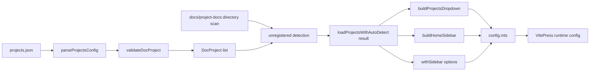

# ARCHITECTURE

本書は `vitepress-docs-hub` の設計を、責務分離とデータフローの観点で整理したものです。  
実装の正本は `docs/.vitepress/` 配下のコードです。

## 1. 設計方針

- VitePress 設定を「宣言」と「生成ロジック」に分離する
- 生成ロジックを責務ごとに小さなモジュールへ分割する
- 型定義とバリデーションを分離し、境界で実行時検証する
- 外部入力（JSON / ファイルシステム）を早期に正規化する

## 2. コンポーネント構成

```text
docs/.vitepress/
├─ config.mts                      # エントリポイント。最終的な VitePress 設定を組み立てる
├─ config-data/
│  └─ projects.json                # プロジェクト定義データ
└─ config-builder/
   ├─ types.ts                     # ドメイン型 (DocProject, ProjectsConfig, ...)
   ├─ validators.ts                # 構造/値バリデーション + パーサ
   ├─ projectLoader.ts             # projects.json 読み込み + 未登録プロジェクト検出
   ├─ navBuilder.ts                # グローバルナビ(プロジェクトドロップダウン)生成
   └─ homeSidebarBuilder.ts        # トップページ用サイドバー生成
```

## 3. モジュール責務

### `config.mts`

- `loadProjectsWithAutoDetect` でプロジェクト一覧を取得
- `defineConfig` で基本設定を定義
- `withSidebar` でプロジェクト別サイドバーを自動生成
- トップページ用サイドバー (`/`) を合成し、最終設定を export

### `types.ts`

- `DocProject`, `ProjectEntry`, `ProjectsConfig` などの型を提供
- バリデーションロジックは持たない

### `validators.ts`

- `projects.json` の構造検証 (`parseProjectsConfig`)
- `DocProject` 値検証 (`validateName`, `validatePath`, `validateDocProject`)
- パース結果を `ParseResult<T>` で返す

### `projectLoader.ts`

- `projects.json` を読み込み、`validators.ts` で正規化
- カテゴリキーを `DocProject.category` に反映
- `docs/project-docs/` 直下ディレクトリとの差分を取り、未登録プロジェクトを補完

### `navBuilder.ts`

- `DocProject[]` から `DefaultTheme.NavItemWithChildren` を生成
- カテゴリあり/なしを判別して dropdown を構築

### `homeSidebarBuilder.ts`

- `docs/` 直下 `.md` を走査しトップページ項目を生成
- frontmatter の `title` を優先採用
- プロジェクトをカテゴリでグルーピングし、トップページサイドバーへ統合

## 4. データフロー



## 5. 境界設計

### 入力境界

- `projects.json` は外部入力として扱い、`unknown` から検証して型へ変換する
- ファイルシステム走査結果は未登録補完ロジックで吸収する

### 型境界

- VitePress の UI 構造は `DefaultTheme` 型に合わせる
- 内部ドメインは `DocProject` に統一する

### エラー境界

- JSON パース失敗・検証失敗・個別不正エントリは警告ログで可視化する
- 続行可能な範囲で処理継続し、サイト生成停止を避ける

## 6. テスト戦略

- `tests/docProject.test.ts`
  - `validateName` / `validatePath` をプロパティベースで検証
- `tests/navBuilder.test.ts`
  - dropdown 生成の整合性を例示 + プロパティベースで検証

## 7. 設計上のトレードオフ

- メリット
  - 設定追加の運用負荷が低い
  - モジュール分割で保守しやすい
  - 型境界と実行時境界を明示できる

- デメリット
  - `docs/project-docs/` 直下ディレクトリが自動検出対象のため、意図しない露出が起こり得る
  - ログ警告ベースのため、CI で厳密に失敗させたい運用には追加実装が必要

## 8. 将来拡張ポイント

- CI での strict validation モード（警告ではなく fail）
- `projects.json` に `repoUrl` などメタデータを拡張し、トップページカードを自動生成
- `tests` 実行スクリプトを `package.json` に追加し、標準開発フローへ統合
